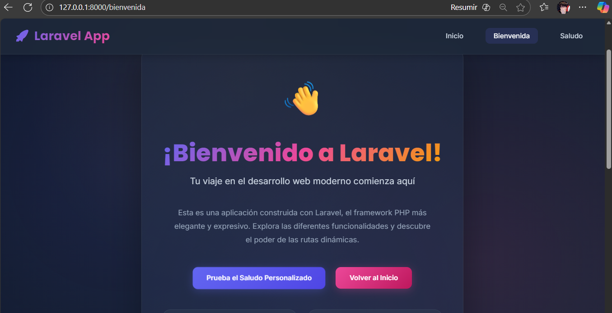
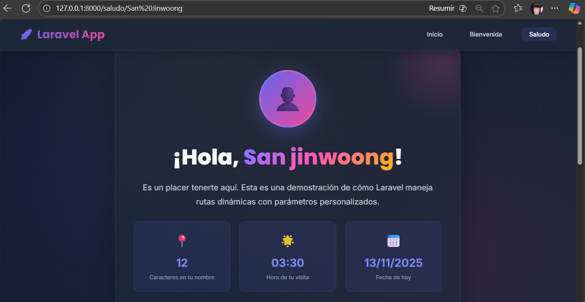
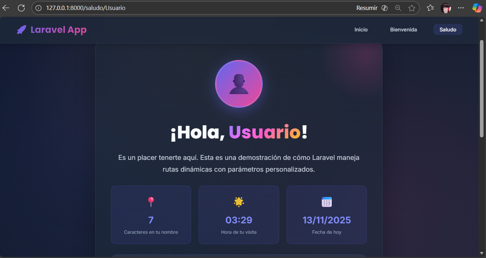

# Proyecto Laravel - Rutas Estáticas y Dinámicas# Proyecto Laravel - Fundamentos de Rutas, Controladores y Vistas<p align="center"><a href="https://laravel.com" target="_blank"></a></p>


## 📋 Descripción


Este proyecto demuestra la implementación de **rutas estáticas y dinámicas** en Laravel utilizando controladores y vistas Blade.## 📋 Descripción del Proyecto<p align="center">


## 🎯 Objetivo del Proyecto<a href="https://github.com/laravel/framework/actions"></a>


Aprender y aplicar los conceptos fundamentales de Laravel:Este proyecto Laravel demuestra el uso de **rutas estáticas y dinámicas**, **controladores** y **vistas Blade** con un diseño moderno y profesional siguiendo las mejores prácticas de UX/UI.<a href="https://packagist.org/packages/laravel/framework"></a>

- Definir rutas estáticas y dinámicas

- Crear controladores para manejar la lógica<a href="https://packagist.org/packages/laravel/framework"></a>

- Utilizar vistas Blade para presentar información

- Pasar parámetros dinámicos a través de URLs## ✨ Características Principales<a href="https://packagist.org/packages/laravel/framework"></a>


## 🚀 Funcionalidades Implementadas</p>


### 1. Ruta Estática: `/bienvenida`### 1. **Ruta Estática de Bienvenida** (`/bienvenida`)

Página de bienvenida que muestra información general del proyecto.

- Página de bienvenida completamente responsiva## About Laravel

### 2. Ruta Dinámica: `/saludo/{nombre}`

Página que captura el nombre desde la URL y muestra un saludo personalizado. Por ejemplo:- Diseño moderno con degradados y animaciones suaves

- `/saludo/Carlos` → Muestra "¡Hola, Carlos!"

- `/saludo/María` → Muestra "¡Hola, María!"- Tarjetas de características con efectos hoverLaravel is a web application framework with expressive, elegant syntax. We believe development must be an enjoyable and creative experience to be truly fulfilling. Laravel takes the pain out of development by easing common tasks used in many web projects, such as:


## 📂 Estructura del Código- Botones de llamada a la acción (CTA)


### Controlador: `PaginaController.php`- [Simple, fast routing engine](https://laravel.com/docs/routing).

```php

public function bienvenida()### 2. **Ruta Dinámica de Saludo** (`/saludo/{nombre}`)- [Powerful dependency injection container](https://laravel.com/docs/container).

{

    return view('bienvenida');- Captura parámetros dinámicos desde la URL- Multiple back-ends for [session](https://laravel.com/docs/session) and [cache](https://laravel.com/docs/cache) storage.

}

- Muestra saludo personalizado con el nombre del usuario- Expressive, intuitive [database ORM](https://laravel.com/docs/eloquent).

public function saludo($nombre)

{- Estadísticas interactivas (caracteres, hora, fecha)- Database agnostic [schema migrations](https://laravel.com/docs/migrations).

    $nombreFormateado = ucfirst(strtolower($nombre));

    return view('saludo', ['nombre' => $nombreFormateado]);- Formulario para cambiar el nombre dinámicamente- [Robust background job processing](https://laravel.com/docs/queues).

}

```- Transiciones y animaciones fluidas- [Real-time event broadcasting](https://laravel.com/docs/broadcasting).


### Rutas: `web.php`

```php

Route::get('/', function () {### 3. **Diseño Profesional**Laravel is accessible, powerful, and provides tools required for large, robust applications.

    return redirect('/bienvenida');

});- Layout coherente con navbar moderna


Route::get('/bienvenida', [PaginaController::class, 'bienvenida'])- Paleta de colores actualizada (indigo, pink, amber, green)## Learning Laravel

    ->name('bienvenida');

    - Tipografías Google Fonts (Inter & Poppins)

Route::get('/saludo/{nombre}', [PaginaController::class, 'saludo'])

    ->name('saludo');- Totalmente responsivo (móvil, tablet, desktop)Laravel has the most extensive and thorough [documentation](https://laravel.com/docs) and video tutorial library of all modern web application frameworks, making it a breeze to get started with the framework. You can also check out [Laravel Learn](https://laravel.com/learn), where you will be guided through building a modern Laravel application.

```

- Efectos de blur y backdrop-filter

### Vistas

- `layouts/app.blade.php` - Layout principal con navbar y footer- Animaciones CSS avanzadasIf you don't feel like reading, [Laracasts](https://laracasts.com) can help. Laracasts contains thousands of video tutorials on a range of topics including Laravel, modern PHP, unit testing, and JavaScript. Boost your skills by digging into our comprehensive video library.

- `bienvenida.blade.php` - Vista estática

- `saludo.blade.php` - Vista dinámica que recibe el parámetro `$nombre`


## 💻 Instalación## 🛠️ Tecnologías Utilizadas## Laravel Sponsors


1. **Clonar el repositorio**

   ```bash

   git clone <url-del-repositorio>- **Framework:** Laravel 11.xWe would like to extend our thanks to the following sponsors for funding Laravel development. If you are interested in becoming a sponsor, please visit the [Laravel Partners program](https://partners.laravel.com).

   cd p1

   ```- **PHP:** 8.2+


2. **Instalar dependencias**- **Frontend:** Blade Templates, CSS3, JavaScript (Vanilla)### Premium Partners

   ```bash

   composer install- **Fuentes:** Google Fonts (Inter, Poppins)

   ```

- **Diseño:** CSS Grid, Flexbox, Custom Properties- **[Vehikl](https://vehikl.com)**

3. **Configurar entorno**

   ```bash- **Animaciones:** CSS Animations, Transitions- **[Tighten Co.](https://tighten.co)**

   cp .env.example .env

   php artisan key:generate- **[Kirschbaum Development Group](https://kirschbaumdevelopment.com)**

   ```

## 📂 Estructura del Proyecto- **[64 Robots](https://64robots.com)**

4. **Iniciar servidor**

   ```bash- **[Curotec](https://www.curotec.com/services/technologies/laravel)**

   php artisan serve

   ``````- **[DevSquad](https://devsquad.com/hire-laravel-developers)**


5. **Abrir en navegador**p1/- **[Redberry](https://redberry.international/laravel-development)**

   ```

   http://localhost:8000├── app/- **[Active Logic](https://activelogic.com)**

   ```

│   └── Http/

## 🌐 Rutas Disponibles

│       └── Controllers/## Contributing

| URL | Tipo | Descripción |

|-----|------|-------------|│           └── PaginaController.php    # Controlador principal

| `/` | Redireccion | Redirige a `/bienvenida` |

| `/bienvenida` | Estática | Página de bienvenida |├── resources/Thank you for considering contributing to the Laravel framework! The contribution guide can be found in the [Laravel documentation](https://laravel.com/docs/contributions).

| `/saludo/{nombre}` | Dinámica | Saludo personalizado con el nombre |

│   └── views/

## 📸 Capturas de Pantalla

│       ├── layouts/## Code of Conduct

### Página de Bienvenida

Ruta estática que muestra la página principal del proyecto.│       │   └── app.blade.php          # Layout base


│       ├── bienvenida.blade.php       # Vista estáticaIn order to ensure that the Laravel community is welcoming to all, please review and abide by the [Code of Conduct](https://laravel.com/docs/contributions#code-of-conduct).


---│       ├── saludo.blade.php           # Vista dinámica


### Ruta Dinámica - Vista Superior│       └── welcome.blade.php          # Página inicial## Security Vulnerabilities

Saludo personalizado capturando el parámetro desde la URL (`/saludo/San%20Jinwoong`).

├── routes/



│   └── web.php                        # Definición de rutasIf you discover a security vulnerability within Laravel, please send an e-mail to Taylor Otwell via [taylor@laravel.com](mailto:taylor@laravel.com). All security vulnerabilities will be promptly addressed.

---

└── README.md                          # Este archivo

### Ruta Dinámica - Vista Inferior

Sección con formulario interactivo para probar diferentes nombres.```## License





## ✅ Conceptos Aplicados## 🚀 Instalación y ConfiguraciónThe Laravel framework is open-sourced software licensed under the [MIT license](https://opensource.org/licenses/MIT).


- ✅ Rutas en Laravel (estáticas y dinámicas)

- ✅ Controladores### Requisitos Previos

- ✅ Vistas Blade

- ✅ Paso de parámetros desde controlador a vista- PHP >= 8.2

- ✅ Captura de parámetros desde URL- Composer

- ✅ Layouts con `@extends` y `@section`- Servidor web (Apache/Nginx) o `php artisan serve`

- Git

## 🛠️ Tecnologías

### Pasos de Instalación

- **Laravel** 11.x

- **PHP** 8.2+1. **Clonar el repositorio**

- **Blade** Templates   ```bash

   git clone <url-del-repositorio>

---   cd p1

   ```

**Proyecto Académico** - Fundamentos de Laravel

2. **Instalar dependencias**
   ```bash
   composer install
   ```

3. **Configurar el archivo .env**
   ```bash
   cp .env.example .env
   php artisan key:generate
   ```

4. **Iniciar el servidor de desarrollo**
   ```bash
   php artisan serve
   ```

5. **Acceder a la aplicación**
   Abrir el navegador en: `http://localhost:8000`

## 🌐 Rutas Disponibles

| Ruta | Método | Descripción | Controlador |
|------|--------|-------------|-------------|
| `/` | GET | Redirige a `/bienvenida` | Closure |
| `/bienvenida` | GET | Página de bienvenida estática | `PaginaController@bienvenida` |
| `/saludo/{nombre}` | GET | Saludo personalizado dinámico | `PaginaController@saludo` |

## 💡 Ejemplos de Uso

### Ruta Estática
```
http://localhost:8000/bienvenida
```
Muestra una página de bienvenida con información sobre el proyecto.

### Ruta Dinámica
```
http://localhost:8000/saludo/Carlos
http://localhost:8000/saludo/María
http://localhost:8000/saludo/Visitante
```
Personaliza el saludo según el nombre proporcionado en la URL.

## 🎨 Características de Diseño

### Paleta de Colores
- **Primary:** `#6366f1` (Indigo)
- **Secondary:** `#ec4899` (Pink)
- **Accent:** `#f59e0b` (Amber)
- **Success:** `#10b981` (Green)
- **Background:** `#0f172a` (Slate Dark)

### Tipografía
- **Headings:** Poppins (700-800 weight)
- **Body:** Inter (400-600 weight)

## 📱 Responsive Design

Breakpoints implementados:
- **Móvil:** < 768px
- **Tablet:** 768px - 1024px
- **Desktop:** > 1024px

## 🔧 Desarrollo

### Estructura del Controlador

```php
class PaginaController extends Controller
{
    public function bienvenida()
    {
        return view('bienvenida');
    }

    public function saludo($nombre)
    {
        $nombreFormateado = ucfirst(strtolower($nombre));
        return view('saludo', ['nombre' => $nombreFormateado]);
    }
}
```

### Definición de Rutas

```php
Route::get('/bienvenida', [PaginaController::class, 'bienvenida'])
    ->name('bienvenida');
    
Route::get('/saludo/{nombre}', [PaginaController::class, 'saludo'])
    ->name('saludo');
```

## 📝 Buenas Prácticas Implementadas

✅ Separación de responsabilidades (MVC)  
✅ Nombres descriptivos y convenciones Laravel  
✅ DRY (Don't Repeat Yourself) con layouts  
✅ Diseño responsive y mobile-first  
✅ Código limpio y bien documentado  
✅ Performance optimizado  
✅ Experiencia de usuario fluida  

## 🎯 Objetivos de Aprendizaje Cumplidos

✅ Definir rutas en Laravel (estáticas y dinámicas)  
✅ Crear y utilizar controladores  
✅ Pasar datos desde controladores a vistas  
✅ Trabajar con Blade templates  
✅ Aplicar diseño moderno y profesional  
✅ Implementar responsive design  

## 📸 Capturas de Pantalla

### Vista de la Página de Bienvenida
Página estática accesible en `/bienvenida` que muestra el hero section con diseño moderno, tarjetas de características y botones de llamada a la acción.


---

### Vista de la Ruta Dinámica - Saludo Personalizado
Ejemplo de ruta dinámica en `/saludo/San%20Jinwoong` que captura el parámetro desde la URL y muestra:
- Avatar con las iniciales del usuario
- Saludo personalizado con gradiente de colores
- Estadísticas en tiempo real (caracteres, hora, fecha)
- Sección "¿Sabías que...?" explicando el funcionamiento de parámetros dinámicos
- Formulario interactivo para cambiar el nombre
- Botones de navegación


---

### Vista de la Ruta Dinámica - Sección Inferior
Continuación de la página de saludo mostrando:
- Formulario para probar con otro nombre
- Formato de URL explicado: `/saludo/San jinwoong`
- Botones de navegación (Ir a Bienvenida, Volver al Inicio)


## ✍️ Autor

Creado por : Mendez Padron Gustavo Emanuel
Proyecto académico - Curso de Laravel  
Fecha: Noviembre 2024

## 🙏 Agradecimientos

- Laravel Framework
- Comunidad de Laravel
- Google Fonts
